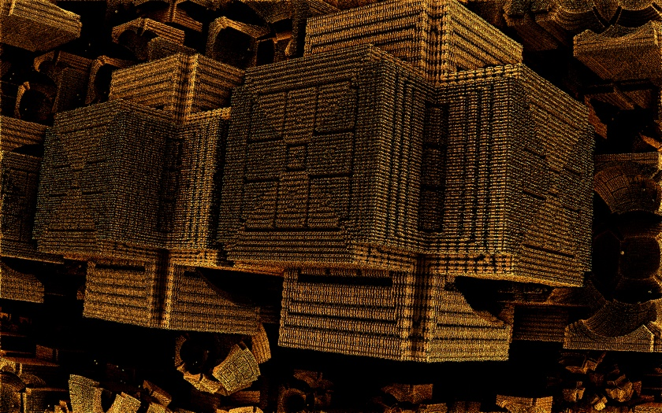

# 👋 Hello, I'm lack0fcode!

---

## 🧑‍💻 About Me

- 💡 Computer Engineering Student exploring the intersection of software, cloud infrastructure, and data.
- 🌱 Constantly learning and experimenting with new technologies.
- 👥 Enjoy collaborating on open source and impactful projects.
- 🌎 Aiming to solve real-world problems with technology.

---

## 🛠️ Top Skills

   &nbsp;
   &nbsp;
   &nbsp;
   &nbsp;
   &nbsp;
   &nbsp;
   &nbsp;
  

---

## 📫 Connect with Me

---

## 🌟 GitHub Status

  
More detailed stats

  
  
   
  

---

> “Code is like humor. When you have to explain it, it’s bad.” – Cory House

---

_Thanks for visiting! ⭐️_
